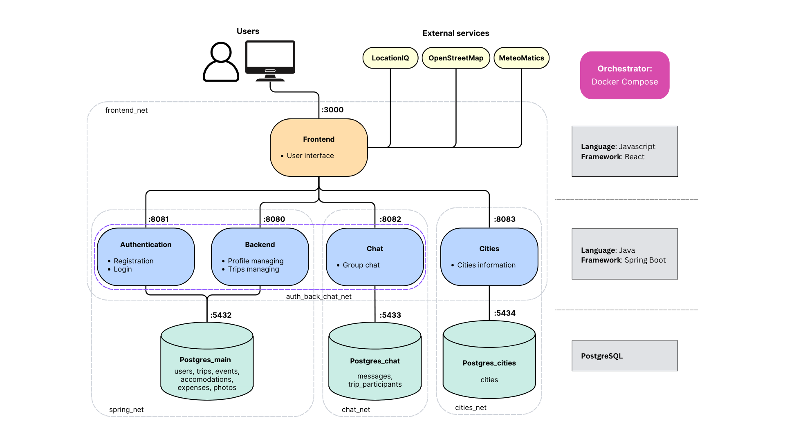

# SYSTEM DESCRIPTION:

Our system is organized as shown in the picture: there are 8 Docker containers, orchestrated by Docker Compose. One container runs the frontend, 4 containers run different microservices of the backend, and 3 containers run the PostgreSQL Docker image and together they constitute the database of our application.
The frontend also connects to some external services: Locationiq, OpenStreetMap and MeteoMatics. The containers are organized by Docker Compose in four different networks: spring_net, frontend_net, chat_net and cities_net, ensuring separation between containers that aren't meant to exchange data.

[da rimuovere, template: https://drive.google.com/file/d/1stCQoen6ojT3hBexAkyp0Ja8H6XzOuFn/view ]

# USER STORIES:

| \#  | Title                              | User story                                                       |
| -- | ----------------------------------------- | -------------------------------------------------------------------------------------------------------------------------------------------------------- |
| 1  | Registration                              | As a future user, I want to register via email and password, to begin using the application.                                                             |
| 2  | Login                                     | As a user, I want to login, to access the application's features.                                                                                        |
| 3  | Account deletion                          | As a user, I want to delete my account.                                                                                                                  |
| 4  | Seeing the profile                        | As a user, I want to access my profile, to see my information.                                                                                           |
| 5  | Changing username                         | As a user, I want to modify my username.                                                                                                                 |
| 6  | Changing password                         | As a user, I want to modify my password.                                                                                                                 |
| 7  | Seeing the trips                          | As a user, I want to see all my trips.                                                                                                                   |
| 8  | Searching trips                           | As a user, I want to search my trips by title or destination.                                                                                            |
| 9  | Seeing the invitations                    | As a user, I want to see my pending invitations to some trips.                                                                                           |
| 10 | Trip creation                             | As a user, I want to create a Trip, to start planning my trip.                                                                                           |
| 11 | Trip deletion                             | As a trip creator, I want to delete a Trip.                                                                                                              |
| 12 | Inviting to a trip                        | As a trip creator, I want to invite other users to my trip, to share trip information with them.                                                         |
| 13 | Accepting an invitation                   | As a user, I want to accept an invitation to a trip.                                                                                                     |
| 14 | Refusing an invitation                    | As a user, I want to refuse an invitation to a trip.                                                                                                     |
| 15 | Revoking an invitation                    | As a trip creator, I want to revoke an invitation that has been sent.                                                                                    |
| 16 | Leaving a trip                            | As a trip participant, I want to leave the trip.                                                                                                         |
| 17 | Removing a participant                    | As a trip creator, I want to remove a participant from my trip.                                                                                          |
| 18 | Changing a trip's title                   | As a trip participant, I want to modify the trip's title.                                                                                                |
| 19 | Changing a trip's dates                   | As a trip participant, I want to modify the trip's dates.                                                                                                |
| 20 | Changing a trip's destinations            | As a trip participant, I want to modify the trip's destinations.                                                                                         |
| 21 | Seeing the schedule                       | As a trip participant, I want to see the trip's schedule.                                                                                                |
| 22 | Schedule filtering                        | As a trip participant, I want to filter my schedule by a specific day.                                                                                   |
| 23 | Weather                                   | As a trip participant, I want to see the weather prediction for every day of the trip, to better plan my activities                                      |
| 24 | Activity creation                         | As a trip participant, I want to add an activity to a trip's schedule                                                                                    |
| 25 | Activity deletion                         | As a trip participant, I want to delete an activity from a trip's schedule                                                                               |
| 26 | Seeing an activity's details              | As a trip participant, I want to see the details of an activity from the schedule.                                                                       |
| 27 | Changing an activity's information        | As a trip participant, I want to modify an activity's name, time, place, date, address and additional information.                                       |
| 28 | Adding an attachment to an activity       | As a trip participant, I want to add an attachment to an activity, to save tickets/reservations/etc                                                      |
| 29 | Seeing an activity's map                  | As a trip participant, I want to see a map with a marker on the activity's address.                                                                      |
| 30 | Seeing an activity's attachments          | As a trip participant, I want to see an activity's attachments, to check the tickets/reservations/etc                                                    |
| 31 | Downloading an activity's attachments     | As a trip participant, I want to be able to download the attachments of an activity                                                                      |
| 32 | Travel creation                           | As a trip participant, I want to add a travel to a trip's schedule                                                                                       |
| 33 | Travel deletion                           | As a trip participant, I want to delete a travel from a trip's schedule                                                                                  |
| 34 | Seeing a travel's details                 | As a trip participant, I want to see the details of a travel from the schedule.                                                                          |
| 35 | Changing a travel's information           | As a trip participant, I want to modify a travel's name, departure time, arrival time, departure place, arrival place, date, and additional information. |
| 36 | Adding an attachment to a travel          | As a trip participant, I want to add an attachment to a travel, to save tickets/reservations/etc                                                         |
| 37 | Seeing a travel's map                     | As a trip participant, I want to see a map with a marker on the travel's departure address                                                               |
| 38 | Seeing a travel's attachments             | As a trip participant, I want to see a travel's attachments, to check the tickets/reservations/etc                                                       |
| 39 | Downloading a travel's attachments        | As a trip participant, I want to be able to download the attachments of a travel                                                                         |
| 40 | Changing a night's place                  | As a trip participant, I want to change the main location of a night                                                                                     |
| 41 | Accomodation creation                     | As a trip participant, I want to create an accomodation spanning several nights, to save information about it                                            |
| 42 | Accomodation deletion                     | As a trip participant, I want to delete an accomodation                                                                                                  |
| 43 | Seeing an accomodation's details          | As a trip participant, I want to see the details of a night's accomodation                                                                               |
| 44 | Changing an accomodation's information    | As a trip participant, I want to modify an accomodation's name, check-in and check-out time, dates, contacts, address and additional information.        |
| 45 | Adding an attachment to an accomodation   | As a trip participant, I want to add an attachment to an accomodation, to save tickets/reservations/etc                                                  |
| 46 | Seeing an accomodation's attachments      | As a trip participant, I want to see an accomodation's attachments, to check the tickets/reservations/etc                                                |
| 47 | Downloading an accomodation's attachments | As a trip participant, I want to be able to download the attachments of an accomodation                                                                  |
| 48 | Expense creation                          | As a trip participant, I want to create a new expense, to settle up at the end of the trip                                                               |
| 49 | Changing an expense's title               | As a trip participant, I want to change the title of an expense                                                                                          |
| 50 | Changing an expense's amount              | As a trip participant, I want to change the mount of an expense                                                                                          |
| 51 | Changing an expense's split               | As a trip participant, I want to change the split of an expense                                                                                          |
| 52 | Changing an expense's date                | As a trip participant, I want to change the date of an expense                                                                                           |
| 53 | Delete an expense                         | As a trip participant, I want to delete an expense                                                                                                       |
| 54 | Seeing balances                           | As a trip participant, I want to see how much I spent during the trip                                                                                    |
| 55 | Seeing debts                              | As a trip participant, I want to know who I have to pay back                                                                                             |
| 56 | Seeing credits                            | As a trip participant, I want to know who have to pay me back                                                                                            |
| 57 | Debt compensation                         | As a trip participant, I want to settle my debts                                                                                                         |
| 58 | Detbs reminder                            | As a trip participant, I want to remind other users to settle their debts with me                                                                        |
| 59 | Write message                             | As a trip participant, I want to send a message to the others participants in a group chat                                                               |
| 60 | Read message                              | As a trip participant, I want to see the message sent in the group chat in real time                                                                     |
| 61 | Delete message                            | As the user who sent a message, I want to delete that message                                                                                            |
| 62 | Modify message                            | As the user who sent a message, I wanto to modify that message                                                                                           |
| 63 | Check message                             | As the user who sent a message, I want to see if other participants receive and/or read the message                                                      |
| 64 | Seeing the photos                         | As a trip participant, I want to see the photos of a trip uploaded by me and the other participants                                                      |
| 65 | Uploading a photo                         | As a trip participant, I want to upload a photo of a trip                                                                                                |
| 66 | Deleting a photo                          | As a trip participant, I want to delete a photo of a trip                                                                                                |
| 67 | City suggestion                           | As a user who's creating or updating a trip, I want to see be suggested names of cities                                                                  |

# CONTAINERS:

## CONTAINER_NAME: authentication

### DESCRIPTION: 
This container runs the microservice of the authentication (registration and login) of users.

### USER STORIES:
1, 2

### PORTS: 
- 8081

### PERSISTENCE EVALUATION
To ensure the persistence of data, we used the Spring Data JPA interface, that allowed us to implement JPA-based (Java Persistence API) repositories.

### EXTERNAL SERVICES CONNECTIONS
This container doesn't connect to any external service.

### MICROSERVICES:
- Registration and authentication

### MICROSERVICE: Registration and authentication
- TYPE: backend
- DESCRIPTION: Allows a user to register and to login.
- PORTS: 8081
- TECHNOLOGICAL SPECIFICATION: Microservice realized in Java using the SpringBoot framework. It uses a PostgreSQL database and exposes a REST interface on port 8081.
- SERVICE ARCHITECTURE: 
<description of the architecture of the microservice>

- ENDPOINTS:
		
	| HTTP METHOD | URL | Description | User Stories |
	| ----------- | --- | ----------- | ------------ |
    | POST | /api/auth/login | Logs the user in, returning a JWT token | 2 |
    | POST | /api/auth/register | Registers a user, returning a JWT token | 1 |

- DB STRUCTURE:

	**_users_** :	| **_id_** | email | nickname | password | role |

## CONTAINER_NAME: backend

### DESCRIPTION: 
This container runs the microservices related to the main functionalities of the application.

### USER STORIES:
4, 5, 7-22, 24-27, 32-35, 40, 41, 43, 44, 64-66

### PORTS: 
- 8080

### PERSISTENCE EVALUATION
To ensure the persistence of data, we used the Spring Data JPA interface, that allowed us to implement JPA-based (Java Persistence API) repositories.

### EXTERNAL SERVICES CONNECTIONS
This container doesn't connect to any external service.

### MICROSERVICES:
- Profile managing
- Trips managing
  

#### MICROSERVICE: Profile managing
- TYPE: backend
- DESCRIPTION: Allows a user to see and modify their personal data, and to accept or refuse invitations sent by other users.
- PORTS: 8080
- TECHNOLOGICAL SPECIFICATION: Microservice realized in Java using the SpringBoot framework. It uses a PostgreSQL database and exposes a REST interface on port 8080.
- SERVICE ARCHITECTURE: 
<description of the architecture of the microservice>

- ENDPOINTS:
		
	| HTTP METHOD | URL | Description | User Stories |
	| ----------- | --- | ----------- | ------------ |
    | GET | /profile | Returns the personal data of the logged user | 4, 9 |
    | PUT | /profile/nickname | Changes the user's nickname | 5 |
    | PUT | /profile/password | Changes the user's password | 5 |
    | POST | /profile/invitations/{id} | Allows the user to accept or refuse an invitation to trip {id} |  13, 14 |

- DB STRUCTURE:

	Main table:

	**_users_** :	| **_id_** | email | nickname | password | role |

	Join table:

	**_trips\_invitations_** : | trip\_id | user\_id |

#### MICROSERVICE: Trips managing
- TYPE: backend
- DESCRIPTION: Allows to create and manage a trip: delete it, edit it, invite people to it, etc. It also allows to manage the schedule of a trip: create and manage events (activities or travels) and multi-nights accomodations.
- PORTS: 8080
- TECHNOLOGICAL SPECIFICATION: Microservice realized in Java using the SpringBoot framework. It uses a PostgreSQL database and exposes a REST interface on port 8080.
- SERVICE ARCHITECTURE: 
<description of the architecture of the microservice>

- ENDPOINTS:
		
    | HTTP METHOD | URL | Description | User Stories |
    | ----------- | --- | ----------- | ------------ |
    | POST | /trips | Creates a new trip | 10 |
    | GET | /trips | Returns all trips of the logged user | 7, 8 |
    | GET | /trips/{id} | Returns trip {id} | 7, 8 |
    | DELETE | /trips/{id} | Deletes trip {id} | 11 |
    | POST | /trips/{id}/invite | Invites users to trip {id} | 12 |
    | DELETE | /trips/{id}/invite | Uninvites users to trip {id} | 15 |
    | DELETE | /trips/{id}/participants | Removes users from trip {id} | 17 |
    | GET | /trips/{id}/leave | Leaves trip {id} | 16 |
    | PUT | /trips/{id}/title | Changes title of trip {id} | 18 |
    | PUT | /trips/{id}/dates | Changes dates of trip {id} | 19 |
    | PUT | /trips/{id}/locations | Changes destinations of trip {id} | 20 |
    | GET | /trips/{id}/schedule | Returns the schedule of trip {id} | 21, 22, 26, 34, 43 |
    | POST | /trips/{id}/schedule/activity | Creates an activity for trip {id} | 24 |
    | DELETE | /trips/{id}/schedule/activity/{activity_id} | Deletes activity {activity_id} from trip {id} | 25 |
    | POST | /trips/{id}/schedule/travel | Creates a travel for trip {id} | 32 |
    | DELETE | /trips/{id}/schedule/travel/{travel_id} | Deletes travel {travel_id} from trip {id} | 33 |
    | POST | /trips/{id}/schedule/overnightstay | Creates an accomodation for trip {id} | 41 |
    | PUT | /trips/{id}/schedule/overnightstay | Edits an accomodation for trip {id} | 44 |
    | PUT | /trips/{id}/schedule/activity/{activity_id}/place | Edits the place of activity {activity_id} of trip {id} | 27 |
    | PUT | /trips/{id}/schedule/activity/{activity_id}/date | Edits the date of activity {activity_id} of trip {id} | 27 |
    | PUT | /trips/{id}/schedule/activity/{activity_id}/name | Edits the name of activity {activity_id} of trip {id} | 27 |
    | PUT | /trips/{id}/schedule/activity/{activity_id}/address | Edits the address of activity {activity_id} of trip {id} | 27 |
    | PUT | /trips/{id}/schedule/activity/{activity_id}/time | Edits the time of activity {activity_id} of trip {id} | 27 |
    | PUT | /trips/{id}/schedule/activity/{activity_id}/info | Edits the additional info of activity {activity_id} of trip {id} | 27 |
    | PUT | /trips/{id}/schedule/travel/{travel_id}/place | Edits the starting place of travel {travel_id} of trip {id} | 35 |
    | PUT | /trips/{id}/schedule/travel/{travel_id}/destination | Edits the destination of travel {travel_id} of trip {id} | 35 |
    | PUT | /trips/{id}/schedule/travel/{travel_id}/date | Edits the date of travel {travel_id} of trip {id} | 35 |
    | PUT | /trips/{id}/schedule/travel/{travel_id}/arrivaldate | Edits the arrival date of travel {travel_id} of trip {id} | 35 |
    | PUT | /trips/{id}/schedule/travel/{travel_id}/address | Edits the departure address of travel {travel_id} of trip {id} | 35 |
    | PUT | /trips/{id}/schedule/travel/{travel_id}/time | Edits the departure and arrival times of travel {travel_id} of trip {id} | 35 |
    | PUT | /trips/{id}/schedule/travel/{travel_id}/info | Edits the additional info of travel {travel_id} of trip {id} | 35 |
    | PUT | /trips/{id}/schedule/night/{night_id}/place | Edits the place of night {night_id} of trip {id} | 40 |
    | GET | /trips/{id}/photos | Returns a list of IDs of all the photos of trip {id} | 64 |
    | POST | /trips/{id}/photos | Uploads a photo to trip {id} | 65 |
    | GET | /trips/{id}/photos/{photo_id} | Returns the binary data of photo {photo_id} of trip {id} | 64 |
    | GET | /trips/{id}/photos/{photo_id}/info | Returns the info of photo {photo_id} of trip {id} | 64 |
    | DELETE | /trips/{id}/photos/{photo_id} | Deletes photo {photo_id} from trip {id} | 66 |

-------------- DA AGGIUNGERE INTERFACCIA SPESE QUANDO JACOPO L'HA FINITA --------------

- DB STRUCTURE:
- 
    Main tables:

	**_trip_** : | **_id_** | creation_date | start_date | end_date | created_by | title | locations | invitations |

	**_activities_** : | **_id_** | trip_id | place | date | type | start_time | end_time | address | name | info |

  	**_travels_** : | **_id_** | trip_id | place | date | type | departure_date | arrival_date | departure_time | arrival_time | address | destination | info |

	**_nights_** : | **_id_** | trip_id | place | date | type | overnight_stay_id | 

	**_overnight\_stay_** : | **_id_** | trip_id | start_date | end_date | start_check_in_time | end_check_in_time | start_check_out_time | end_check_out_time | name | address | contact |

 	**_expenses_** : | **_id_** | trip_id | amount | date | paid_by | split_even | refund | paid_by_nickname | title | 

	**_image\_data_** : | **_id_** | trip_id | uploaded_by_id | upload_date | name | type | description | imagedata | 

 
    Join tables:

    **_trips\_invitations_** : | trip\_id | user\_id |

    **_trips\_participation_** : | trip\_id | user\_id |

    **_amount\_per\_user_** : | expense_id | amount_per_user |

#### <other microservices>

## <other containers>

